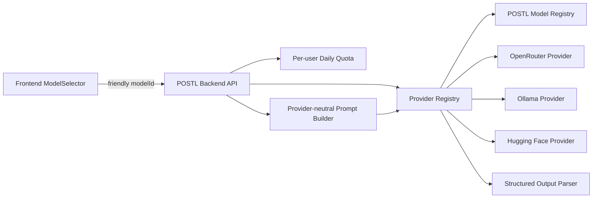

# POSTL AI Provider Architecture

## Objective

POSTL now treats AI generation as a provider-agnostic backend capability instead of a frontend-visible dependency on a single local Ollama model. The goal is an MVP architecture that can serve early users with low infrastructure cost, switch cloud providers without frontend changes, and keep Ollama as a strong local-development experience.

## Previous design

The previous implementation had several production blockers:

- Ollama was effectively the assumed default engine.
- Production could accidentally depend on `http://localhost:11434`, which is invalid from a hosted backend or browser deployment.
- Frontend model IDs and provider model IDs were coupled.
- `/api/models` returned provider details, but not a stable POSTL model catalog.
- Provider failures could bubble up as unclear frontend messages such as undefined engine errors or missing request IDs.
- OpenRouter and Hugging Face existed as modules, but provider selection and friendly model routing were inconsistent.
- There was no server-side per-user quota hook for MVP abuse control.

## New design

## Provider interface contract

Each provider module exposes a consistent contract:

- `name`, `enabled`, `metadata`
- configuration validation through `validateConfig()`
- provider health through `health()`
- generation through `generate({ prompt, temperature, timeoutMs, requestId, model })`
- normalized provider results containing provider, model, text, latency, finish reason, and usage where available
- normalized error classification for configuration errors, unavailable providers, timeouts, rate limits, missing models, HTTP errors, network errors, parse failures, schema failures, and client cancellation

Future providers such as Gemini, Groq, Together AI, Claude, OpenAI, or a private inference host should only need a new provider module plus model catalog entries. Generation endpoints and frontend code should not change.

## Model registry

The frontend requests friendly POSTL model IDs, not raw provider model names.

Current default catalog:

| POSTL model ID | Provider | Provider model source | Purpose | Default exposure |
| --- | --- | --- | --- | --- |
| `balanced-cloud` | OpenRouter | `OPENROUTER_MODEL` | recommended production MVP model | enabled when `OPENROUTER_API_KEY` exists |
| `local-gemma` | Ollama | `OLLAMA_MODEL` | local development model | enabled only in development |
| `economy-hf` | Hugging Face | `HF_MODEL` | optional low-cost fallback | enabled when `HF_TOKEN` exists |

`AI_MODELS` can restrict which friendly model IDs are exposed without code changes.

## Provider selection

Environment variables control provider behavior:

- `AI_PRIMARY_PROVIDER`
- `AI_FALLBACK_PROVIDERS`
- `AI_MODELS`
- `OPENROUTER_API_KEY`, `OPENROUTER_MODEL`, `OPENROUTER_HTTP_REFERER`, `OPENROUTER_APP_TITLE`
- `OLLAMA_URL`, `OLLAMA_MODEL`
- `HF_TOKEN`, `HF_MODEL`

If `AI_PRIMARY_PROVIDER` is unset:

- production defaults to `openrouter`
- development defaults to `ollama`

Ollama is intentionally disabled as a production default so POSTL cannot accidentally require localhost. A production Ollama deployment is still possible if a real persistent inference host is deliberately configured in future work.

## Error handling

Backend provider failures now use stable error codes and a consistent API envelope. Every Express response has a request ID header. Safe provider metadata can be included in error responses without exposing API keys, prompts, generated content, tokens, or service-account data.

Frontend API errors now distinguish:

- API not configured
- network unavailable
- timeout
- backend validation errors
- quota exceeded
- provider unavailable
- structured backend errors
- unexpected server responses

This prevents undefined user-facing diagnostics and surfaces request IDs for support.

## MVP quota policy

Authenticated generation now passes through a server-side daily quota check before provider calls. The default policy is:

- `USER_DAILY_GENERATION_LIMIT=25`
- `USER_DAILY_REPURPOSE_LIMIT=10`

Quota counters are stored in Firestore via Firebase Admin in `usageQuotas` documents keyed by user, quota kind, and UTC day. Client state cannot bypass this. A value of `0` disables the limit for controlled environments.

## Production deployment recommendation

Recommended MVP production mode:

1. Vercel hosts the static Vite frontend.
2. A persistent Node backend host such as Render hosts `backend/src/server.js`.
3. Backend production provider is OpenRouter.
4. Ollama remains for local development, not public production.
5. Firebase Admin credentials are configured only on the backend host.
6. Vercel receives only public `VITE_FIREBASE_*` values and `VITE_API_BASE_URL`.

This avoids paying for GPU infrastructure initially while keeping provider flexibility.

## Remaining limitations

- Live OpenRouter credentials are not present in the repository and must be configured on the backend host.
- Provider integration tests currently use syntax/build checks and frontend error contract tests. Deeper mocked Supertest provider-chain tests should be added before calling the system production-complete.
- The backend is deployment-ready for Render, but live production generation still requires external dashboard configuration for Render, Firebase Admin, OpenRouter, and Vercel `VITE_API_BASE_URL`.
