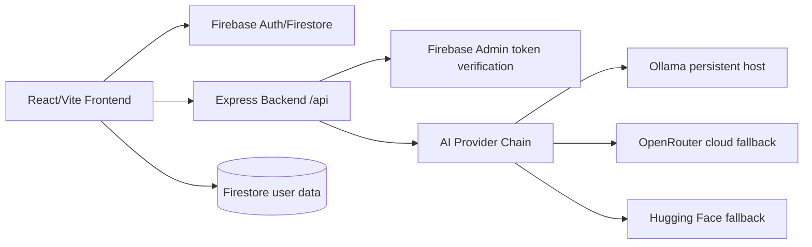

# POSTL Architecture

## Runtime topology



## Frontend

- React 18, TypeScript, Vite, Tailwind, Framer Motion.
- `src/firebase.ts` reads Vite environment variables and initializes Analytics only when supported.
- `src/api/client.ts` centralizes API requests, request IDs, timeouts, token headers, and error normalization.
- `src/store/useStore.ts` keeps local UI preferences and usage counters.
- Dashboard tabs: Studio, Library, Brand, Campaign, Analytics.

## Backend

Entry points:

- `backend/src/server.js`: local server startup.
- `backend/src/app.js`: Express app for local/serverless import.
- `backend/server.js`: compatibility wrapper.
- `netlify/functions/api.js`: serverless wrapper.

Important modules:

- `config/env.js`: environment loading and validation.
- `config/firebaseAdmin.js`: explicit Firebase Admin initialization state.
- `middleware/*`: request ID, rate limit, auth, error handling.
- `routes/*`: health, models, generation, feedback, repurpose.
- `services/providers/*`: Ollama, OpenRouter, Hugging Face providers.
- `services/generation/*`: prompt builder, output parser, brief analyzer, platform-fit score, strategy metadata.
- `services/cache/cache.service.js`: local user-isolated LRU-style cache.

## API response envelope

Success:

```json
{ "data": {}, "error": null }
```

Error:

```json
{ "data": null, "error": { "code": "...", "message": "...", "requestId": "...", "retryable": false } }
```

## Legacy Python AI service

`backend/LocalAIServer/server.py` remains as an experimental legacy GPT-2 Large Flask server. It is no longer launched by default because GPT-2 Large is not instruction-tuned and should not be an automatic production fallback.

## Stage 2 API Route Contract

All application API routes are mounted under `/api`. The Netlify compatibility mount `/.netlify/functions/api` exists for serverless wrapping, but the recommended production backend is a persistent Node service.

| Method | Path | Auth | Request schema | Response schema | Rate limit | Persistence | Current status |
| --- | --- | --- | --- | --- | --- | --- | --- |
| GET | `/api/health` | Public | None | `{ data: { status, firebaseAdmin, providers, cache }, error: null }` | General API limiter | None | Functional but should be split into liveness/readiness. |
| GET | `/api/models` | Public | None | `{ data: { models, platforms, objectives, tones }, error: null }` | General API limiter | None | Functional, but provider health checks are shallow and model availability is mostly config-based. |
| POST | `/api/generate-post` | Firebase ID token | `generationSchema` in `backend/src/validation/generation.schema.js` | `{ data: { requestId, variants, briefAnalysis, benchmarkTiming }, error: null }` | General API limiter only | Client currently writes generated post to Firestore after response | Functional generation boundary, but backend-controlled persistence, idempotency, per-user quota, integration tests, and partial-success schema are missing. |
| POST | `/api/repurpose` | Firebase ID token | Reuses generation schema plus `sourceContent` | Same generation response envelope | General API limiter only | None authoritative | Backend route exists, frontend workflow incomplete, persistence/idempotency/tests missing. |
| POST | `/api/feedback` | Firebase ID token | Lightweight feedback body | `{ data: { received: true }, error: null }` | General API limiter only | Currently route-level behavior only, no robust feedback data model | Needs definition, anti-spam, variant linkage, and storage policy. |

Contract gaps found in Stage 2:

- There are no backend routes yet for brands, campaigns, posts/history, versions, preferences, usage accounting, or analytics.
- Frontend Brand Voice and Campaign UI currently does not prove full backend-backed workspace behavior.
- Client-side Firestore writes remain authoritative for generated posts, which is not production-grade for provider metadata, ownership, prompt version, or idempotency.
- `/api/health` should be split into liveness and readiness before production deployment.
- Expensive AI routes need separate rate limits, authenticated per-user quotas, idempotency keys, cancellation tests, and deterministic mocked-provider integration tests.
