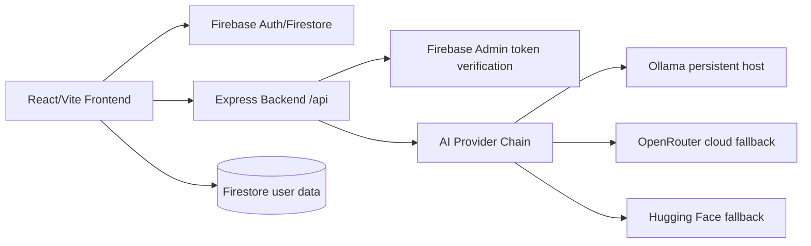

# POSTL Architecture

## Runtime topology



## Frontend

- React 18, TypeScript, Vite, Tailwind, Framer Motion.
- `src/firebase.ts` reads Vite environment variables and initializes Analytics only when supported.
- `src/api/client.ts` centralizes API requests, request IDs, timeouts, token headers, and error normalization.
- `src/store/useStore.ts` keeps local UI preferences and usage counters.
- Dashboard tabs: Studio, Library, Brand, Campaign, Analytics.

## Backend

Entry points:

- `backend/src/server.js`: local server startup.
- `backend/src/app.js`: Express app for local/serverless import.
- `backend/server.js`: compatibility wrapper.
- `netlify/functions/api.js`: serverless wrapper.

Important modules:

- `config/env.js`: environment loading and validation.
- `config/firebaseAdmin.js`: explicit Firebase Admin initialization state.
- `middleware/*`: request ID, rate limit, auth, error handling.
- `routes/*`: health, models, generation, feedback, repurpose.
- `services/providers/*`: Ollama, OpenRouter, Hugging Face providers.
- `services/generation/*`: prompt builder, output parser, brief analyzer, platform-fit score, strategy metadata.
- `services/cache/cache.service.js`: local user-isolated LRU-style cache.

## API response envelope

Success:

```json
{ "data": {}, "error": null }
```

Error:

```json
{ "data": null, "error": { "code": "...", "message": "...", "requestId": "...", "retryable": false } }
```

## Legacy Python AI service

`backend/LocalAIServer/server.py` remains as an experimental legacy GPT-2 Large Flask server. It is no longer launched by default because GPT-2 Large is not instruction-tuned and should not be an automatic production fallback.
